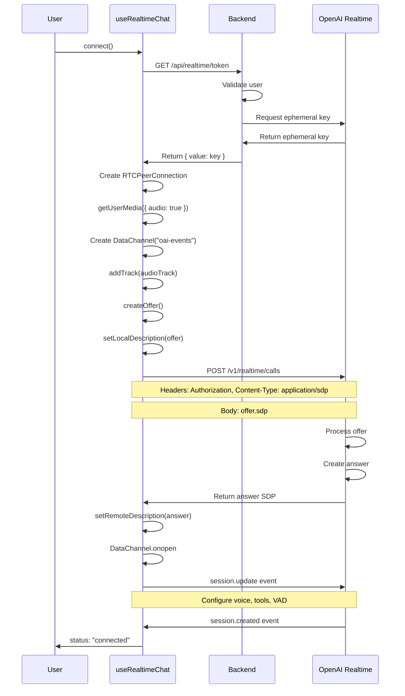

# 🎙️ CopilotKit + OpenAI Realtime Integration Guide

## Table of Contents
1. [Overview](#overview)
2. [Architecture Deep Dive](#architecture-deep-dive)
3. [How It Works](#how-it-works)
4. [Implementation Details](#implementation-details)
5. [API Reference](#api-reference)
6. [Usage Examples](#usage-examples)
7. [WebRTC Connection Flow](#webrtc-connection-flow)
8. [Tool/Action Bridging](#toolaction-bridging)
9. [Troubleshooting](#troubleshooting)
10. [Contributing](#contributing)

---

## Overview

This integration brings **OpenAI's Realtime API** (WebRTC-based voice conversations) directly into **CopilotKit**, enabling developers to build voice-enabled AI applications with ultra-low latency while maintaining all of CopilotKit's powerful features like actions, shared state, and UI components.

### Key Benefits

- **🚀 Ultra-Low Latency**: Direct WebRTC connection to OpenAI's servers
- **🎯 Unified Experience**: Voice and text conversations in the same UI
- **⚡ Real-time Transcription**: Live speech-to-text with interim results
- **🔧 Action Integration**: Voice can trigger CopilotKit actions
- **🎨 Flexible UI**: Use CopilotKit's components or build custom interfaces
- **📊 Full Observability**: All conversations tracked in CopilotKit's system

---

## Architecture Deep Dive

### System Components

```
┌─────────────────────────────────────────────────────────────┐
│                         Browser/Client                        │
├─────────────────────────────────────────────────────────────┤
│                                                               │
│  ┌─────────────────┐        ┌─────────────────────────┐     │
│  │   Microphone    │───────▶│   useRealtimeChat Hook  │     │
│  │   (MediaStream) │        │                         │     │
│  └─────────────────┘        │  - WebRTC Management    │     │
│                             │  - Event Processing     │     │
│  ┌─────────────────┐        │  - Message Bridging     │     │
│  │    Speaker      │◀───────│  - Tool Registration    │     │
│  │  (Audio Output) │        └───────────┬─────────────┘     │
│  └─────────────────┘                    │                   │
│                                         │                   │
│                                         ▼                   │
│                          ┌──────────────────────────┐       │
│                          │   CopilotKit Context     │       │
│                          │                          │       │
│                          │  - Message State         │       │
│                          │  - Action Registry       │       │
│                          │  - UI Components         │       │
│                          └──────────────────────────┘       │
└─────────────────────────────────────────────────────────────┘
                                    │
                                    │ WebRTC
                                    │ DataChannel
                                    ▼
┌─────────────────────────────────────────────────────────────┐
│                    OpenAI Realtime API                       │
├─────────────────────────────────────────────────────────────┤
│                                                               │
│  ┌──────────────┐    ┌──────────────┐    ┌──────────────┐  │
│  │     ASR      │───▶│   GPT-4o     │───▶│     TTS      │  │
│  │  (Speech to  │    │   Realtime   │    │   (Text to   │  │
│  │    Text)     │    │    Model     │    │    Speech)   │  │
│  └──────────────┘    └──────────────┘    └──────────────┘  │
│                                                               │
└─────────────────────────────────────────────────────────────┘
```

### Data Flow

1. **Voice Input** → WebRTC → OpenAI ASR → Transcript Event
2. **Transcript Event** → useRealtimeChat → CopilotKit Message
3. **CopilotKit Message** → UI Update → User sees transcript
4. **OpenAI Response** → Audio Stream + Text → Parallel Updates
5. **Tool Calls** → Bridge to CopilotKit Actions → Execute Handler

---

## How It Works

### 1. Initialization Phase

```typescript
// The hook establishes WebRTC connection with OpenAI
const {
  connect,
  disconnect,
  status,
  isConnected,
  isMuted,
  toggleMute,
} = useRealtimeChat({
  tokenEndpoint: '/api/realtime/token',  // Your backend endpoint
  model: 'gpt-4o-realtime-preview',      // ACTUAL model name used
  voice: 'alloy',                        // Assistant voice
});
```

### 2. Connection Establishment

When `connect()` is called:

1. **Fetch Ephemeral Token**: Securely get temporary OpenAI credentials
2. **Create RTCPeerConnection**: Initialize WebRTC peer connection
3. **Setup Media Streams**: 
   - Get user microphone permission
   - Create audio tracks for bidirectional communication
4. **Create Data Channel**: For real-time events and messages
5. **SDP Exchange**: 
   - Create offer with local description
   - Send to OpenAI's WHIP endpoint
   - Receive answer and set remote description
6. **Session Configuration**: Send initial settings (voice, tools, etc.)

### 3. Message Synchronization

The integration automatically synchronizes messages between OpenAI Realtime and CopilotKit:

```typescript
// Inside useRealtimeChat hook
const handleRealtimeEvent = useCallback(async (event: any) => {
  switch (event.type) {
    case "conversation.item.created":
      // Extract message content
      const message: Message = {
        id: event.item.id,
        role: event.item.role,
        content: extractContent(event.item),
      };
      
      // Send to CopilotKit's message system
      await sendMessage(message);
      break;
      
    case "conversation.item.input_audio_transcription.completed":
      // Handle completed transcriptions
      await sendMessage({
        id: event.item_id,
        role: "user",
        content: event.transcript,
      });
      break;
      
    case "response.function_call_arguments.done":
      // Bridge to CopilotKit actions
      await executeAction(event.name, event.arguments);
      break;
  }
}, [sendMessage, executeAction]);
```

### 4. Audio Processing Pipeline

```
Microphone Input
    │
    ├─> [getUserMedia API]
    │
    ├─> [MediaStream]
    │
    ├─> [RTCPeerConnection.addTrack()]
    │
    ├─> [WebRTC Audio Encoding (Opus)]
    │
    └─> [OpenAI Realtime Server]
            │
            ├─> Voice Activity Detection (VAD)
            ├─> Speech Recognition (ASR)
            ├─> Natural Language Understanding
            ├─> Response Generation
            ├─> Text-to-Speech (TTS)
            └─> [Audio Stream Back]
                    │
                    └─> [RTCPeerConnection.ontrack]
                            │
                            └─> [Audio Element Playback]
```

---

## Implementation Details

### CRITICAL: Event Names and Configuration

**The most important discovery during implementation:**

1. **Correct Event Name**: `conversation.item.input_audio_transcription.completed`
   - NOT `conversation.item.audio_transcription.completed` 
   - The `input_` prefix is REQUIRED for user transcripts

2. **Transcription Configuration**: Must explicitly enable transcription
   ```typescript
   input_audio_transcription: {
     model: "whisper-1"  // REQUIRED to receive transcript events
   }
   ```

3. **Parameter Naming**: Use snake_case for all parameters
   - ✅ `prefix_padding_ms`, `silence_duration_ms`
   - ❌ `prefixPaddingMs`, `silenceDurationMs`

### Complete Working Session Configuration

```typescript
const sessionConfig = {
  type: "session.update",
  session: {
    modalities: ["text", "audio"],
    voice: "alloy",  // or "echo", "shimmer", etc.
    instructions: "You are a helpful AI assistant integrated with CopilotKit.",
    input_audio_transcription: {
      model: "whisper-1"  // CRITICAL: Must be present
    },
    turn_detection: {
      type: "server_vad",
      threshold: 0.5,
      prefix_padding_ms: 300,     // snake_case!
      silence_duration_ms: 500,    // snake_case!
    },
    tools: registeredTools,  // CopilotKit actions as tools
  }
};
```

## Implementation Details

### Core Hook: `useRealtimeChat`

Located in: `/packages/react-core/src/hooks/use-realtime-chat.ts`

#### Key Features:

1. **WebRTC Management**
   - Handles peer connection lifecycle
   - Manages ICE candidates
   - Implements SDP offer/answer exchange

2. **Event Processing**
   - Parses OpenAI Realtime events
   - Converts to CopilotKit message format
   - Handles errors and reconnection

3. **Audio Controls**
   - Microphone muting/unmuting
   - Audio level monitoring
   - Voice activity detection

4. **Tool Registration**
   - Converts CopilotKit actions to OpenAI tool format
   - Bridges tool calls back to action handlers

### Message Conversion

```typescript
// OpenAI Realtime Event Format
{
  type: "conversation.item.created",
  item: {
    id: "msg_123",
    type: "message",
    role: "assistant",
    content: [{
      type: "text",
      text: "Hello! How can I help?"
    }]
  }
}

// Converted to CopilotKit Message
{
  id: "msg_123",
  role: "assistant",
  content: "Hello! How can I help?"
}
```

---

## API Reference

### `useRealtimeChat(config: RealtimeConfig)`

Main hook for OpenAI Realtime integration.

#### Parameters

```typescript
interface RealtimeConfig {
  /** Endpoint to fetch ephemeral token */
  tokenEndpoint: string;
  
  /** OpenAI Realtime model (default: "gpt-realtime") */
  model?: string;
  
  /** Voice for assistant */
  voice?: "alloy" | "echo" | "fable" | "onyx" | "nova" | "shimmer";
  
  /** Turn detection configuration */
  turnDetection?: {
    type: "server_vad";
    threshold?: number;        // 0-1, default: 0.5
    prefixPaddingMs?: number;  // default: 300
    silenceDurationMs?: number; // default: 500
  };
  
  /** Enable debug logging */
  debug?: boolean;
}
```

#### Return Value

```typescript
interface UseRealtimeChatReturn {
  /** Connect to OpenAI Realtime */
  connect: () => Promise<void>;
  
  /** Disconnect from OpenAI Realtime */
  disconnect: () => void;
  
  /** Current connection status */
  status: "idle" | "connecting" | "connected" | "error";
  
  /** Error message if connection failed */
  error?: string;
  
  /** Whether microphone is currently active */
  isMicActive: boolean;
  
  /** Toggle microphone on/off */
  toggleMic: () => void;
  
  /** Current audio level (0-1) for visualization */
  audioLevel: number;
  
  /** Register tools/functions for the realtime session */
  registerTools: (tools: RealtimeToolDefinition[]) => void;
}
```

#### Tool Definition Format

```typescript
interface RealtimeToolDefinition {
  name: string;
  description: string;
  parameters: {
    type: "object";
    properties: Record<string, {
      type: string;
      description?: string;
      enum?: string[];
    }>;
    required?: string[];
  };
}
```

---

## Usage Examples

### Basic Voice Chat

```tsx
import { CopilotKit, useRealtimeChat } from '@copilotkit/react-core';
import { CopilotChat } from '@copilotkit/react-ui';

function VoiceEnabledChat() {
  const { connect, disconnect, status, isMicActive, toggleMic } = useRealtimeChat({
    tokenEndpoint: '/api/realtime/token',
    voice: 'alloy'
  });

  return (
    <div>
      {status === 'idle' && (
        <button onClick={connect}>Start Voice Chat</button>
      )}
      
      {status === 'connected' && (
        <>
          <button onClick={toggleMic}>
            {isMicActive ? '🎙️ Mute' : '🔇 Unmute'}
          </button>
          <button onClick={disconnect}>End Call</button>
        </>
      )}
      
      <CopilotChat />
    </div>
  );
}
```

### With Actions/Tools

```tsx
function VoiceAssistant() {
  const { connect, registerTools } = useRealtimeChat({
    tokenEndpoint: '/api/realtime/token'
  });
  
  // Register a CopilotKit action
  useCopilotAction({
    name: 'scheduleAppointment',
    description: 'Schedule an appointment',
    parameters: [
      { name: 'date', type: 'string', required: true },
      { name: 'time', type: 'string', required: true }
    ],
    handler: async (args) => {
      // Your appointment logic here
      await bookAppointment(args);
      return `Appointment scheduled for ${args.date} at ${args.time}`;
    }
  });
  
  // Register the same action with Realtime
  useEffect(() => {
    registerTools([{
      name: 'scheduleAppointment',
      description: 'Schedule an appointment',
      parameters: {
        type: 'object',
        properties: {
          date: { type: 'string', description: 'Date (YYYY-MM-DD)' },
          time: { type: 'string', description: 'Time (HH:MM)' }
        },
        required: ['date', 'time']
      }
    }]);
  }, [registerTools]);
  
  // ... rest of component
}
```

### Custom Audio Visualization

```tsx
function AudioVisualizer() {
  const { audioLevel, isMicActive } = useRealtimeChat({
    tokenEndpoint: '/api/realtime/token'
  });
  
  return (
    <div className="audio-visualizer">
      <div 
        className="audio-bar"
        style={{
          width: `${audioLevel * 100}%`,
          backgroundColor: isMicActive ? '#10b981' : '#6b7280',
          transition: 'width 0.1s ease-out'
        }}
      />
      <span>{Math.round(audioLevel * 100)}%</span>
    </div>
  );
}
```

### Advanced: Multi-Modal Interface

```tsx
function MultiModalAssistant() {
  const [mode, setMode] = useState<'text' | 'voice'>('text');
  const { connect, disconnect, status } = useRealtimeChat({
    tokenEndpoint: '/api/realtime/token'
  });
  
  const handleModeSwitch = async (newMode: 'text' | 'voice') => {
    if (newMode === 'voice' && status === 'idle') {
      await connect();
    } else if (newMode === 'text' && status === 'connected') {
      disconnect();
    }
    setMode(newMode);
  };
  
  return (
    <div>
      <ToggleGroup value={mode} onValueChange={handleModeSwitch}>
        <ToggleGroupItem value="text">⌨️ Text</ToggleGroupItem>
        <ToggleGroupItem value="voice">🎙️ Voice</ToggleGroupItem>
      </ToggleGroup>
      
      <CopilotChat
        labels={{
          initial: mode === 'voice' 
            ? '🎙️ Speak to interact...' 
            : '⌨️ Type your message...'
        }}
      />
    </div>
  );
}
```

---

## WebRTC Connection Flow

### Actual Implementation Details

```typescript
// 1. Fetch ephemeral token from your backend
const tokenResponse = await fetch(config.tokenEndpoint);
const { ephemeralToken } = await tokenResponse.json();

// 2. Create peer connection with STUN server
const pc = new RTCPeerConnection({
  iceServers: [{ urls: "stun:stun.l.google.com:19302" }]
});

// 3. Add microphone audio track
const stream = await navigator.mediaDevices.getUserMedia({ 
  audio: {
    echoCancellation: true,
    noiseSuppression: true,
    autoGainControl: true
  }
});
const audioTrack = stream.getTracks()[0];
pc.addTrack(audioTrack, stream);

// 4. Create data channel for events
const dc = pc.createDataChannel("oai-events", {
  ordered: true,
  protocol: "json"
});

// 5. Create and send offer
const offer = await pc.createOffer();
await pc.setLocalDescription(offer);

// 6. Send offer to OpenAI and get answer
const response = await fetch("https://api.openai.com/v1/realtime/sessions", {
  method: "POST",
  headers: {
    "Authorization": `Bearer ${ephemeralToken}`,
    "Content-Type": "application/json"
  },
  body: JSON.stringify({
    model: "gpt-4o-realtime-preview-2024-12-17",
    voice: "alloy",
    instructions: systemMessage,
    input_audio_transcription: { model: "whisper-1" },  // CRITICAL!
    turn_detection: {
      type: "server_vad",
      threshold: 0.5,
      prefix_padding_ms: 300,
      silence_duration_ms: 500
    }
  })
});

const { answer } = await response.json();
await pc.setRemoteDescription(answer);
```

## WebRTC Connection Flow

### Detailed Connection Sequence



### Error Handling

The integration includes comprehensive error handling:

1. **Connection Errors**
   - Token fetch failures
   - WebRTC negotiation failures
   - Network disconnections

2. **Permission Errors**
   - Microphone access denied
   - Browser compatibility issues

3. **Runtime Errors**
   - Invalid event data
   - Tool execution failures
   - Message conversion errors

```typescript
// Error handling example
try {
  await connect();
} catch (error) {
  if (error.name === 'NotAllowedError') {
    // Microphone permission denied
    console.error('Please allow microphone access');
  } else if (error.message.includes('token')) {
    // Token endpoint issue
    console.error('Authentication failed');
  } else {
    // Other errors
    console.error('Connection failed:', error);
  }
}
```

---

## Tool/Action Bridging

### How Tools Work in Realtime

1. **Registration**: Tools are registered with the Realtime session
2. **Invocation**: User speech triggers tool detection
3. **Execution**: Tool calls are bridged to CopilotKit actions
4. **Response**: Results are spoken back to the user

### Tool Registration Flow (ACTUAL IMPLEMENTATION)

```typescript
// Step 1: Define CopilotKit action
useCopilotAction({
  name: 'searchDatabase',
  parameters: [
    { name: 'query', type: 'string' }
  ],
  handler: async ({ query }) => {
    const results = await db.search(query);
    return results;
  }
});

// Step 2: Tools are AUTO-REGISTERED from CopilotKit actions!
// The hook automatically converts CopilotKit actions to OpenAI tools:
const registeredTools = actions.map(action => ({
  type: "function",  // REQUIRED by OpenAI
  name: action.name,
  description: action.description,
  parameters: {
    type: "object",
    properties: action.parameters?.reduce((acc, param) => {
      acc[param.name] = { 
        type: param.type,
        description: param.description 
      };
      return acc;
    }, {}) || {},
    required: action.parameters
      ?.filter(p => p.required)
      .map(p => p.name) || []
  }
}));

// Step 3: Bridge executes automatically
// When user says: "Search for recent orders"
// 1. Realtime detects tool need
// 2. Sends tool call event
// 3. Bridge executes CopilotKit action
// 4. Results returned to Realtime
// 5. Assistant speaks results
```

### Advanced Tool Patterns

#### Conditional Tools

```typescript
// Register tools based on user permissions
useEffect(() => {
  const tools = [];
  
  if (user.canSchedule) {
    tools.push(scheduleAppointmentTool);
  }
  
  if (user.canAccessRecords) {
    tools.push(searchRecordsTool);
  }
  
  registerTools(tools);
}, [user, registerTools]);
```

#### Tool with Complex Parameters

```typescript
registerTools([{
  name: 'createOrder',
  description: 'Create a new order',
  parameters: {
    type: 'object',
    properties: {
      items: {
        type: 'array',
        items: {
          type: 'object',
          properties: {
            productId: { type: 'string' },
            quantity: { type: 'number' }
          }
        }
      },
      shippingAddress: {
        type: 'object',
        properties: {
          street: { type: 'string' },
          city: { type: 'string' },
          zipCode: { type: 'string' }
        }
      }
    }
  }
}]);
```

---

## Troubleshooting

### Common Issues and Solutions

#### 1. Connection Fails

**Symptom**: Status stays "connecting" or shows "error"

**Solutions**:
- Check token endpoint is returning valid ephemeral key
- Verify OpenAI API credentials on backend
- Check browser console for WebRTC errors
- Ensure HTTPS is used (WebRTC requires secure context)

#### 2. No Audio Input/Output

**Symptom**: Connected but no sound

**Solutions**:
```typescript
// Check microphone permissions
navigator.permissions.query({ name: 'microphone' })
  .then(result => {
    if (result.state === 'denied') {
      console.error('Microphone access denied');
    }
  });

// Verify audio tracks
const tracks = streamRef.current?.getAudioTracks();
console.log('Audio tracks:', tracks);
console.log('Track enabled:', tracks?.[0]?.enabled);
```

#### 3. Messages Not Appearing (CRITICAL FIX)

**Symptom**: Voice works but USER messages don't show in UI

**Root Cause**: Event name mismatch
- ❌ Wrong: `conversation.item.audio_transcription.completed`
- ✅ Correct: `conversation.item.input_audio_transcription.completed`

**The Fix**:
```typescript
// Listen for the CORRECT event name
case "conversation.item.input_audio_transcription.completed": {
  const transcript = event.transcript?.trim();
  // Process user transcript...
}
```

**Also Required**:
```typescript
// Must enable transcription in session config
input_audio_transcription: {
  model: "whisper-1"  // WITHOUT this, no transcript events!
}
```

**Other Solutions**:
- Check CopilotKit provider is wrapping the component
- Verify `sendMessage` is from `useCopilotChat` hook
- Check for duplicate message IDs being filtered
- Enable debug mode to see event flow

#### 4. Tools Not Working

**Symptom**: Voice commands don't trigger actions

**Common Issue**: Missing `type: "function"` in tool definition
```typescript
// ❌ Wrong - will error
const tool = {
  name: "myTool",
  description: "...",
  parameters: {...}
};

// ✅ Correct - includes type
const tool = {
  type: "function",  // REQUIRED!
  name: "myTool",
  description: "...",
  parameters: {...}
};
```

**Solutions**:
- Ensure tools are registered after connection
- Verify tool names match between registration and action
- Check parameter schemas match
- Test with simple tools first

#### 5. Parameter Naming Errors

**Symptom**: "Unknown parameter" errors from OpenAI

**Root Cause**: OpenAI requires snake_case for ALL parameters

**Examples**:
```typescript
// ❌ Wrong - camelCase
turn_detection: {
  type: "server_vad",
  prefixPaddingMs: 300,     // ERROR!
  silenceDurationMs: 500     // ERROR!
}

// ✅ Correct - snake_case
turn_detection: {
  type: "server_vad",
  prefix_padding_ms: 300,    // Correct
  silence_duration_ms: 500   // Correct
}
```

### Debug Mode

Enable comprehensive logging:

```typescript
const { ... } = useRealtimeChat({
  tokenEndpoint: '/api/realtime/token',
  debug: true  // Enables detailed console logging
});
```

This will log:
- All WebRTC events
- OpenAI Realtime events
- Message conversions
- Tool invocations
- Error details

### Browser Compatibility

| Browser | Support | Notes |
|---------|---------|-------|
| Chrome 90+ | ✅ Full | Recommended |
| Firefox 88+ | ✅ Full | Good alternative |
| Safari 15+ | ⚠️ Partial | Some WebRTC limitations |
| Edge 90+ | ✅ Full | Chrome-based |
| Mobile Chrome | ✅ Full | Android only |
| Mobile Safari | ⚠️ Partial | iOS 15+ required |

---

## Backend Setup

### Token Endpoint Implementation

Your backend needs an endpoint to provide ephemeral tokens:

```typescript
// Next.js API Route Example
// /api/realtime/token/route.ts

import { NextResponse } from 'next/server';

export async function GET(request: Request) {
  // Authenticate user (important!)
  const user = await authenticateUser(request);
  if (!user) {
    return NextResponse.json({ error: 'Unauthorized' }, { status: 401 });
  }
  
  // Get ephemeral token from OpenAI
  const response = await fetch('https://api.openai.com/v1/realtime/sessions', {
    method: 'POST',
    headers: {
      'Authorization': `Bearer ${process.env.OPENAI_API_KEY}`,
      'Content-Type': 'application/json',
    },
    body: JSON.stringify({
      model: 'gpt-4o-realtime-preview',
      voice: 'alloy',
    }),
  });
  
  const data = await response.json();
  
  return NextResponse.json({
    value: data.client_secret.value,
    expires_at: data.client_secret.expires_at,
  });
}
```

### Security Considerations

1. **Always authenticate users** before providing tokens
2. **Use ephemeral tokens** with short expiration
3. **Implement rate limiting** on token endpoint
4. **Log usage** for monitoring and debugging
5. **Validate tool parameters** on backend when sensitive

---

## Performance Optimization

### Best Practices

1. **Lazy Connection**
   ```typescript
   // Don't auto-connect on mount
   // Let user initiate connection
   const handleStartVoice = async () => {
     await connect();
   };
   ```

2. **Connection Pooling**
   ```typescript
   // Reuse connection across components
   const RealtimeProvider = ({ children }) => {
     const realtimeChat = useRealtimeChat({ ... });
     return (
       <RealtimeContext.Provider value={realtimeChat}>
         {children}
       </RealtimeContext.Provider>
     );
   };
   ```

3. **Debounce Audio Level**
   ```typescript
   // Reduce re-renders from audio level updates
   const debouncedAudioLevel = useDebounce(audioLevel, 100);
   ```

4. **Memoize Tools**
   ```typescript
   // Prevent unnecessary tool re-registration
   const tools = useMemo(() => 
     generateTools(config), 
     [config]
   );
   ```

### Network Optimization

- Use STUN/TURN servers for NAT traversal
- Implement connection quality monitoring
- Add retry logic with exponential backoff
- Cache ephemeral tokens (respecting expiry)

---

## Contributing

### How to Contribute

1. **Fork the Repository**
   ```bash
   git clone https://github.com/LuisFX/CopilotKit.git
   cd CopilotKit
   ```

2. **Make Your Changes**
   - Add features to `use-realtime-chat.ts`
   - Update types and exports
   - Add tests if applicable

3. **Build and Test**
   ```bash
   pnpm install
   pnpm build --filter=@copilotkit/react-core
   pnpm test
   ```

4. **Submit PR**
   - Clear description of changes
   - Include usage examples
   - Update documentation

### Areas for Contribution

- **Additional Voices**: Support for more TTS voices
- **Language Support**: Multi-language transcription
- **Advanced VAD**: Custom voice activity detection
- **Conversation Memory**: Persistent conversation history
- **Analytics**: Usage tracking and metrics
- **Error Recovery**: Better reconnection logic
- **Testing**: Unit and integration tests

---

## Future Enhancements

### Planned Features

1. **Conversation Branching**: Fork conversations at any point
2. **Multi-Party Calls**: Support multiple users in same session
3. **Screen Sharing**: Share screen with context
4. **File Uploads**: Send images/documents via voice
5. **Custom Models**: Support for fine-tuned models
6. **Offline Mode**: Queue messages when disconnected

### Experimental Features

```typescript
// Coming soon: Conversation branching
const { branch, branches, switchBranch } = useRealtimeChat({
  enableBranching: true
});

// Coming soon: Multi-party
const { participants, inviteUser } = useRealtimeChat({
  multiParty: true
});

// Coming soon: Rich media
const { sendImage, sendFile } = useRealtimeChat({
  enableMedia: true
});
```

---

## Resources

### Documentation
- [CopilotKit Docs](https://docs.copilotkit.ai)
- [OpenAI Realtime API](https://platform.openai.com/docs/guides/realtime)
- [WebRTC Fundamentals](https://webrtc.org)

### Examples
- [Basic Voice Chat](/examples/basic-voice-chat)
- [Medical Assistant](/examples/medical-assistant)
- [Customer Support](/examples/customer-support)
- [Multi-Modal App](/examples/multi-modal)

### Community
- [GitHub Discussions](https://github.com/CopilotKit/CopilotKit/discussions)
- [Discord Server](https://discord.gg/copilotkit)
- [Twitter Updates](https://twitter.com/copilotkit)

---

## License

MIT License - See [LICENSE](LICENSE) file for details.

---

## Acknowledgments

Special thanks to:
- OpenAI team for the Realtime API
- CopilotKit team for the excellent framework
- WebRTC community for the standards
- All contributors and testers

---

*Built with ❤️ by the CopilotKit Community*